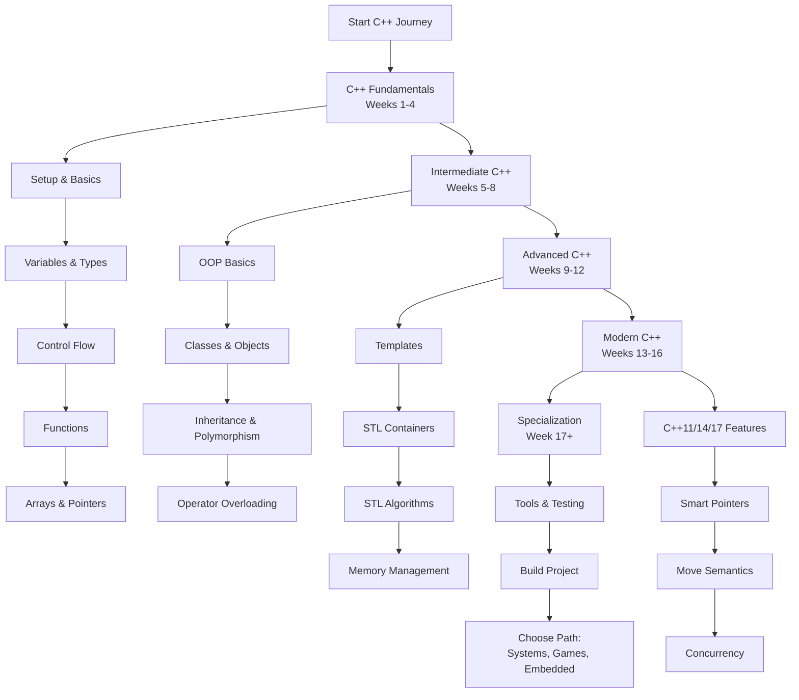

# C++ Developer Learning Path: A Structured Curriculum

This comprehensive roadmap provides a structured approach to mastering C++ development. The curriculum is designed sequentially, with each module building upon previous knowledge to ensure a solid foundation and progressive skill development.

---

## Phase 1: C++ Fundamentals (Weeks 1-4)

*   [**Module 1: Introduction & Development Environment**](https://github.com/ahmadrizal1st/cpp-intro/#readme)
    *   C++ Overview: History, Standards (C++98, C++11, C++14, C++17, C++20, C++23)
    *   Compilation Process: Preprocessor, Compiler, Linker
    *   Setting Up Development Environment: GCC/Clang, VS Code/CLion, Build Systems
    *   Basic Project Structure: Header Files (.h), Source Files (.cpp)
    *   "Hello World" Program and Basic I/O with `iostream`

*   [**Module 2: Basic Syntax and Data Types**](https://github.com/ahmadrizal1st/cpp-basics/#readme)
    *   Fundamental Data Types: `int`, `float`, `double`, `char`, `bool`
    *   Type Modifiers: `signed`, `unsigned`, `short`, `long`
    *   Variable Declaration and Initialization
    *   Constants: `const` and `constexpr`
    *   Type Conversion: Implicit and Explicit Casting
    *   `auto` Keyword for Type Inference

*   [**Module 3: Operators and Expressions**](https://github.com/ahmadrizal1st/cpp-operators/#readme)
    *   Arithmetic Operators: `+`, `-`, `*`, `/`, `%`, `++`, `--`
    *   Relational and Logical Operators
    *   Bitwise Operators: `&`, `|`, `^`, `~`, `<<`, `>>`
    *   Assignment Operators and Compound Assignments
    *   Operator Precedence and Associativity

*   [**Module 4: Control Flow Statements**](https://github.com/ahmadrizal1st/cpp-control-flow/#readme)
    *   Conditional Statements: `if`, `else if`, `else`, `switch`
    *   Looping Structures: `for`, `while`, `do-while`
    *   Range-based for loops (C++11)
    *   Jump Statements: `break`, `continue`, `goto`
    *   `[[nodiscard]]` and `[[fallthrough]]` Attributes

*   [**Module 5: Functions and Scope**](https://github.com/ahmadrizal1st/cpp-functions/#readme)
    *   Function Declaration and Definition
    *   Function Parameters: Pass by Value, Pass by Reference
    *   Return Types and Values
    *   Function Overloading
    *   Default Arguments and Inline Functions
    *   Scope and Storage Duration

---

## Phase 2: Intermediate C++ (Weeks 5-8)

*   [**Module 6: Arrays, Pointers, and References**](https://github.com/ahmadrizal1st/cpp-pointers/#readme)
    *   Arrays: Declaration, Initialization, and Access
    *   Multi-dimensional Arrays
    *   Pointers: Declaration, Address-of Operator (`&`), Dereference Operator (`*`)
    *   Pointer Arithmetic and Array-Pointer Relationship
    *   References: L-value and R-value References
    *   `const` with Pointers and References

*   [**Module 7: Strings and Basic I/O**](https://github.com/ahmadrizal1st/cpp-strings-io/#readme)
    *   C-style Strings: `char` arrays and String Functions
    *   C++ `std::string` Class: Methods and Operations
    *   String Streams: `stringstream`, `istringstream`, `ostringstream`
    *   File I/O: `ifstream`, `ofstream`, `fstream`
    *   Formatted I/O with `iostream`

*   [**Module 8: Introduction to OOP**](https://github.com/ahmadrizal1st/cpp-oop-intro/#readme)
    *   Classes and Objects: Declaration and Definition
    *   Access Specifiers: `public`, `private`, `protected`
    *   Constructors and Destructors
    *   Member Functions and `this` Pointer
    *   Static Members and Functions

*   [**Module 9: Advanced Class Features**](https://github.com/ahmadrizal1st/cpp-advanced-classes/#readme)
    *   Copy Constructor and Copy Assignment Operator
    *   `friend` Functions and Classes
    *   `const` Member Functions and `mutable` keyword
    *   Nested Classes and Local Classes
    *   `explicit` Constructors and Conversion Operators

*   [**Module 10: Operator Overloading**](https://github.com/ahmadrizal1st/cpp-operator-overloading/#readme)
    *   Overloading Arithmetic Operators
    *   Overloading I/O Operators (`<<`, `>>`)
    *   Overloading Subscript (`[]`) and Function Call (`()`) Operators
    *   Overloading Increment/Decrement Operators
    *   Rule of Three/Five/Zero

---

## Phase 3: Advanced C++ Concepts (Weeks 9-12)

*   [**Module 11: Inheritance and Polymorphism**](https://github.com/ahmadrizal1st/cpp-inheritance/#readme)
    *   Base and Derived Classes
    *   Access Control in Inheritance
    *   Function Overriding and `virtual` Functions
    *   Abstract Classes and Pure Virtual Functions
    *   Virtual Destructors and Dynamic Polymorphism
    *   Multiple Inheritance and Virtual Base Classes

*   [**Module 12: Templates**](https://github.com/ahmadrizal1st/cpp-templates/#readme)
    *   Function Templates: Declaration and Instantiation
    *   Class Templates: Specialization and Partial Specialization
    *   Template Parameters: Non-type and Template Template Parameters
    *   Variable Templates (C++14) and Fold Expressions (C++17)
    *   SFINAE and `std::enable_if`

*   [**Module 13: Standard Template Library (STL) - Containers**](https://github.com/ahmadrizal1st/cpp-stl-containers/#readme)
    *   Sequence Containers: `vector`, `deque`, `list`, `array`, `forward_list`
    *   Associative Containers: `set`, `map`, `multiset`, `multimap`
    *   Unordered Containers: `unordered_set`, `unordered_map`
    *   Container Adapters: `stack`, `queue`, `priority_queue`
    *   Iterators: Categories and Operations

*   [**Module 14: STL Algorithms and Function Objects**](https://github.com/ahmadrizal1st/cpp-stl-algorithms/#readme)
    *   Non-modifying Algorithms: `find`, `count`, `equal`, `search`
    *   Modifying Algorithms: `copy`, `transform`, `replace`, `remove`
    *   Sorting and Binary Search Algorithms
    *   Function Objects (Functors) and Lambda Expressions
    *   `std::function` and `std::bind`

---

## Phase 4: Modern C++ (Weeks 13-16)

*   [**Module 15: C++11/14/17 Modern Features**](https://github.com/ahmadrizal1st/cpp-modern-features/#readme)
    *   Uniform Initialization and `std::initializer_list`
    *   `nullptr` and Strongly-typed Enums
    *   Range-based for loops and Structured Bindings (C++17)
    *   `if` and `switch` with Initializer (C++17)
    *   Attributes and `[[maybe_unused]]`

*   [**Module 16: Move Semantics and Smart Pointers**](https://github.com/ahmadrizal1st/cpp-move-smart-pointers/#readme)
    *   R-value References and Move Semantics
    *   Move Constructor and Move Assignment Operator
    *   `std::move` and Perfect Forwarding
    *   Smart Pointers: `unique_ptr`, `shared_ptr`, `weak_ptr`
    *   Custom Deleters and Memory Management

*   [**Module 17: Concurrency and Multithreading**](https://github.com/ahmadrizal1st/cpp-concurrency/#readme)
    *   `std::thread` for Thread Management
    *   Mutexes: `std::mutex`, `std::lock_guard`, `std::unique_lock`
    *   Condition Variables and Atomic Operations
    *   `std::async` and `std::future` for Asynchronous Operations
    *   Thread-safe Data Structures and Patterns

*   [**Module 18: Exception Handling and RAII**](https://github.com/ahmadrizal1st/cpp-exceptions-raii/#readme)
    *   Exception Handling: `try`, `catch`, `throw`
    *   Standard Exception Hierarchy
    *   RAII (Resource Acquisition Is Initialization) Principle
    *   `noexcept` Specifier and Operator
    *   Stack Unwinding and Exception Safety Guarantees

---

## Phase 5: Professional Development & Specialization

*   [**Module 19: Development Tools and Best Practices**](https://github.com/ahmadrizal1st/cpp-tools-best-practices/#readme)
    *   Build Systems: CMake, Makefiles
    *   Debugging with GDB/LLDB
    *   Static Analysis Tools: Clang-Tidy, Cppcheck
    *   Profiling and Performance Optimization
    *   Code Formatting: Clang-Format
    *   Unit Testing: Google Test, Catch2

*   [**Module 20: Capstone Project & Specialization**](https://github.com/ahmadrizal1st/cpp-capstone/#readme)
    *   **Build a Complete C++ Application**
    *   **Choose a Specialization Path:**
        *   **Systems Programming:** Operating Systems, Device Drivers, Low-level Programming
        *   **Game Development:** Game Engines, Graphics Programming, Physics Simulation
        *   **Embedded Systems:** Microcontrollers, Real-time Systems, IoT Applications
        *   **High-Performance Computing:** Parallel Programming, GPU Computing, Scientific Computing
        *   **Financial Systems:** Quantitative Finance, Trading Systems, Risk Management
